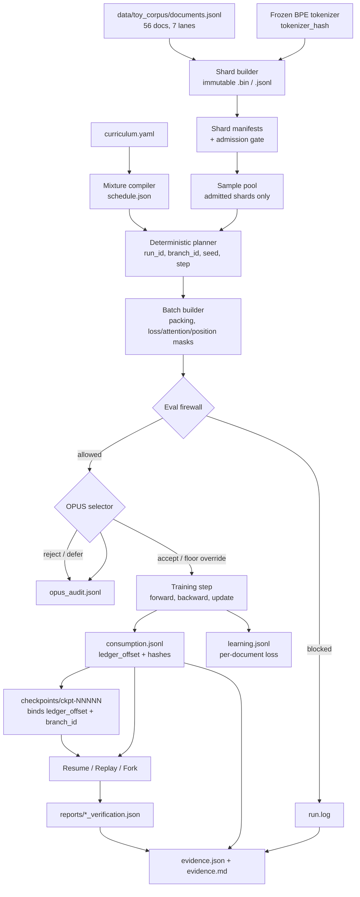

# Session 6 — Training Data Execution System

A small but complete training data system: a frozen BPE tokenizer, immutable tokenized
shards with manifests and an admission gate, two packing policies, a compiled curriculum,
an eval firewall, the OPUS selector, append-only consumption and learning ledgers,
checkpoints bound to ledger offsets, and a run that deliberately crashes and then proves
it resumed, replayed, and forked correctly.

The goal is not scale. It is to show that the data path is **correct, reproducible,
auditable, and measured**, with every claim backed by a file the demo generated.

## One command

```bash
uv run python scripts/run_demo.py
```

It empties `submission_artifacts/`, regenerates everything, and exits non-zero if any
phase fails. Eleven phases, about 10 seconds on CPU:

| # | Phase | What a run produces |
|---|-------|---------------------|
| 1 | Build shards and manifests | 8 shards, 7 admitted, 1 blocked by the admission gate |
| 2 | Compile mixture schedule | 50 steps across foundation, skill_build, anneal |
| 3 | Train, checkpoint, crash | crash at step 25 microbatch 1; 26 committed batches |
| 4 | Resume from checkpoint | `ckpt-00020`, attempt 0 to 1; 26 rows retained, 34 re-committed |
| 5 | Verify resume | 7 compared, 7 matched, 0 skipped, 0 repeated |
| 6 | Replay steps 20..25 | 8 batches re-derived; planner, hashes, and spans all match |
| 7 | Fork a new branch | `run-a-fork-1` from `ckpt-00020`, diverges at step 20 |
| 8 | Packing and throughput | utilization 0.598; ~2,200 loss-bearing tok/s, ~2,700 raw tok/s |
| 9 | Gate activity | OPUS 50/27/13/10, 11 firewall blocks, 120 learning rows linked |
| 10 | Audit `run.log` | 195 events covering all 14 required event types |
| 11 | Evidence bundle | 14/14 requirements passed |

Read `submission_artifacts/evidence.md` first.

## Setup

Install [uv](https://docs.astral.sh/uv/), then from the repo root:

```bash
uv sync --all-groups
uv run python scripts/run_demo.py
uv run pytest tests -v
```

`pyproject.toml` and `uv.lock` define runtime and dev dependencies; `uv sync` creates
`.venv` and installs them. Pytest is configured with `pythonpath = ["src"]`.

GitHub Actions (`.github/workflows/ci.yml`) runs tests, the full demo, and
`verify_artifacts.py` on every push to `main`.

**Optional:** commit a fresh `submission_artifacts/` tree from one demo run if you want
to inspect outputs without re-running the demo; otherwise `.gitignore` keeps it out and
`run_demo.py` recreates it.

## Tests

```bash
uv run pytest tests -v
```

220 tests, CPU only, no GPU and no network. They cover every invariant in
[SCOPE.md](SCOPE.md) §11 plus the tamper tests in `tests/test_evidence.py`, which corrupt
one artifact at a time and require the matching requirement to flip to failed. Six additional
tests in `tests/test_preflight.py` cover the PX stretch scripts.

## Pre-flight (PX stretch)

Audit dataset supply and admission **without** a training run:

```bash
uv run python scripts/dry_run_dataset.py --build-shards
```

Writes `reports/dataset_supply.json`, `reports/admission_audit.json`, `reports/data_card.json`,
and `reports/data_card.md` under `submission_artifacts/`.

Verify generated artifacts in CI:

```bash
uv run python scripts/verify_artifacts.py submission_artifacts
```

Exits 0 when all 14 evidence requirement checks pass; non-zero otherwise.

## Architecture



The gates run **before** any gradient exists. A blocked or rejected microbatch advances
the plan cursor but not `ledger_offset`, so the offset always counts exactly the batches
the model learned from, which is what makes a checkpoint's binding meaningful.

### Subsystem map

| Subsystem | Code | Artifact it produces |
|-----------|------|----------------------|
| Frozen tokenizer | `src/tokenizer/` | `manifests/tokenizer_manifest.json` |
| Shards and admission | `src/shards/` | `shards/`, `manifests/shard_*.json`, `shard_registry.json` |
| Packing and masks | `src/packing/`, `src/batch/` | batch hashes recorded in the ledger |
| Mixture compiler and planner | `src/schedule/` | `schedule.json` |
| Eval firewall | `src/firewall/` | `eval_registry.json`, `firewall_block` events |
| OPUS selector | `src/opus/` | `ledgers/opus_audit.jsonl` |
| Consumption ledger | `src/ledger/` | `ledgers/consumption.jsonl` |
| Learning ledger | `src/ledger/learning*.py` | `ledgers/learning.jsonl` |
| Checkpoints | `src/checkpoint/` | `checkpoints/ckpt-*/` |
| Trainer | `src/trainer/` | weights, `reports/step_timings.jsonl` |
| Recovery | `src/recovery/` | `reports/resume|replay|fork_verification.json`, `ledgers/forks.jsonl` |
| Metrics | `src/metrics/` | `reports/packing_utilization.json`, `reports/throughput.json` |
| Run log | `src/runlog/` | `run.log` |
| Evidence | `src/evidence/` | `evidence.json`, `evidence.md` |
| Orchestrator | `src/demo/`, `scripts/run_demo.py` | the whole tree |

## Design decisions

### Scale: reduce data and compute, not system realism

The corpus is 56 documents and the model is 1.71M parameters (2 layers, `d_model` 128),
so 50 training steps finish in about 4 seconds on CPU. What is *not* reduced: the
tokenizer is the real Session 2 BPE with a merge table, shards are content-hashed and
immutable, manifests carry lineage and license fields, and the ledger contracts are the
ones a production system would need. The demo runs on CPU in about 10 seconds, but the
artifacts — manifests, hashes, ledgers — match what you would audit in a real pipeline.

### The eight locked decisions

| ID | Decision | Why |
|----|----------|-----|
| D1 | Committed toy JSONL corpus | Reproducible without a Session 4 pipeline run |
| D2 | Binary `.bin` for pretrain lanes, JSONL for agentic | Agentic rows need role structure that a flat token array destroys |
| D3 | Three curriculum stages | Enough for a visible stage transition and an anneal reserve |
| D4 | PyTorch trainer | Real autograd, so the loss is a real measurement |
| D5 | Sample-level learning ledger | Per-shard loss attribution needs per-document rows, not per-sequence |
| D6 | CLI reports, no webapp | GitHub submission; artifacts are the deliverable |
| D7 | Session 2 BPE, not a WordLevel toy | `tokenizer_hash` must cover merges, or the freeze proves nothing |
| D8 | `attempt` field on ledger rows | Append-only means a crashed row cannot be deleted; see below |

### Crash, resume, and the `attempt` field

A crash leaves committed ledger rows **ahead** of the newest checkpoint. Resume restores
a checkpoint behind the tail, so it has to re-commit offsets that already exist, and the
ledger is append-only. The resolution is a per-row `attempt`, with uniqueness on
`(attempt, ledger_offset)`:

- the crashed attempt is retained and becomes the **expected** record;
- the resumed attempt is the **actual** record;
- `verify_resume` compares them, and writes neither side.

Learning aggregates drop superseded attempts, because a rolled-back weight update is not
learning the model has. Throughput does the opposite and counts every attempt, because
those batches were really built, padded, and timed.

### Recovery must work from disk alone

The crash writes one `simulated_crash` line to `run.log`, and nothing in the recovery
path reads it. Resume works from the checkpoint and the ledger only. If it needed the
crash record, it would be simulated recovery.

Replay does not train and appends nothing. It re-runs the planner and rebuilds each batch
through tokenize, pack, and mask, then compares. Reading a hash back and comparing it to
itself would prove nothing, so neither check does that.

A fork gets its own lineage at `branches/<branch_id>/`, with offsets from 0. The planner
is seeded on `branch_id`, so the branches diverge without any policy change.

### Evidence is collected, never asserted

`src/evidence/checks.py` reads `submission_artifacts/` and decides from what it finds:
shard hashes are recomputed from the bytes on disk, the tokenizer hash is recomputed from
the committed artifact, resume is re-verified from the ledger using only the parameters
the report records, and every reported rate and ratio is recomputed from the per-row data.
Where a report's own verdict is used, it is compared against a recomputation rather than
trusted.

`tests/test_evidence.py` proves the checks can fail: it corrupts a shard byte, a tokenizer
hash, a schedule step, a ledger row, an audit file, and each verification report, and
requires the matching requirement to fail every time.

## Generated artifacts

`submission_artifacts/` is gitignored and regenerated by the one command:

```text
submission_artifacts/
  run.log                       # ordered event stream, 14 event types (SCOPE.md §9.1)
  evidence.json                 # pass/fail + evidence paths per requirement (§9.2)
  evidence.md                   # human-readable summary, rendered from evidence.json
  schedule.json                 # compiled per-step lane quotas and stage boundaries
  eval_registry.json            # never-train documents, canaries, benchmark IDs
  manifests/                    # shard_*.json, shard_registry.json, tokenizer_manifest.json
  shards/                       # immutable .bin (pretrain) and .jsonl (agentic)
  ledgers/                      # consumption.jsonl, learning.jsonl, opus_audit.jsonl, forks.jsonl
  checkpoints/ckpt-*/           # checkpoint.json + model.pt + optimizer.pt
  branches/<branch_id>/         # the fork's own ledger, reports, and run.log
  reports/                      # resume, replay, fork verification; packing, throughput, timings
```

## Documentation

| Doc | Role |
|-----|------|
| [ASSIGNMENT.md](ASSIGNMENT.md) | Grading contract |
| [SCOPE.md](SCOPE.md) | Architecture, subsystem detail, invariants |

## Limitations

- Single process, CPU, no distributed training or expert parallelism.
- 56 documents; supply is thin enough that some lanes repeat within a run.
- The benchmark overlap check is a stub next to the exact-hash and canary checks.
- Loss falls from 9.24 to about 7.9 over 50 steps. That is a smoke test of the training
  path, not a model worth evaluating.
